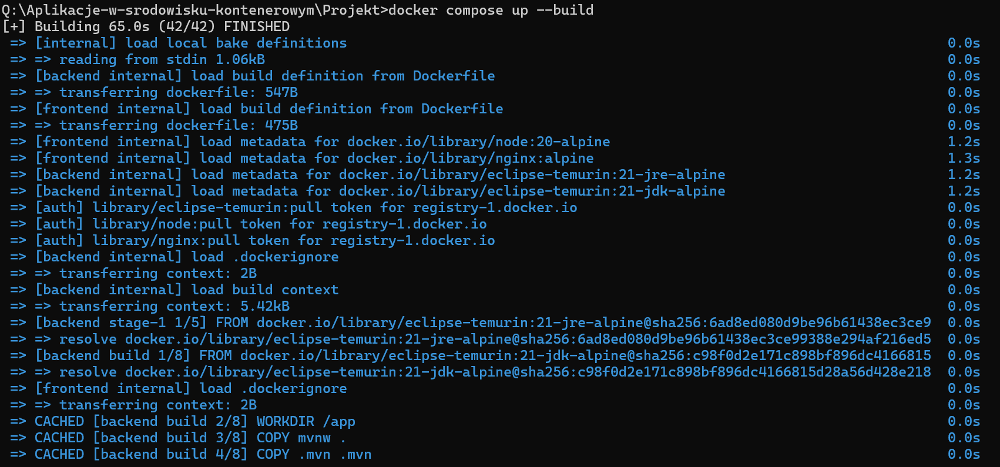
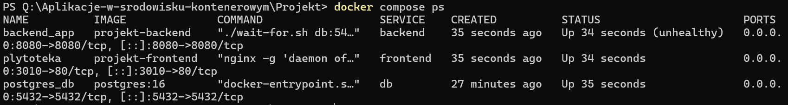
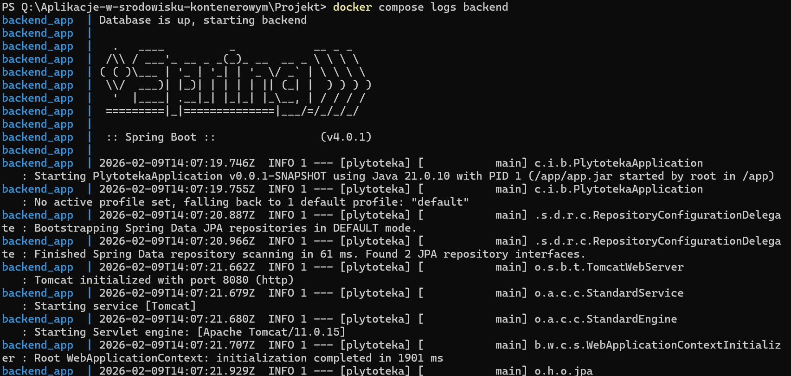
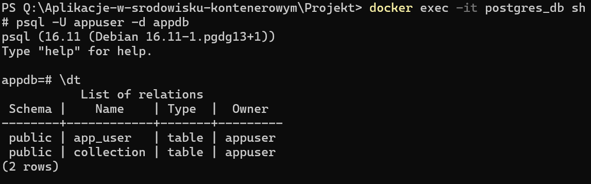
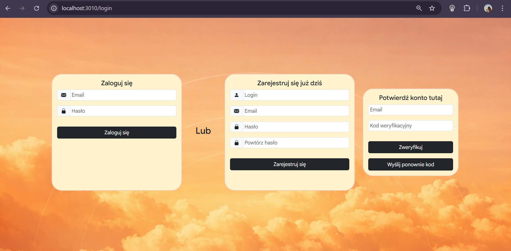
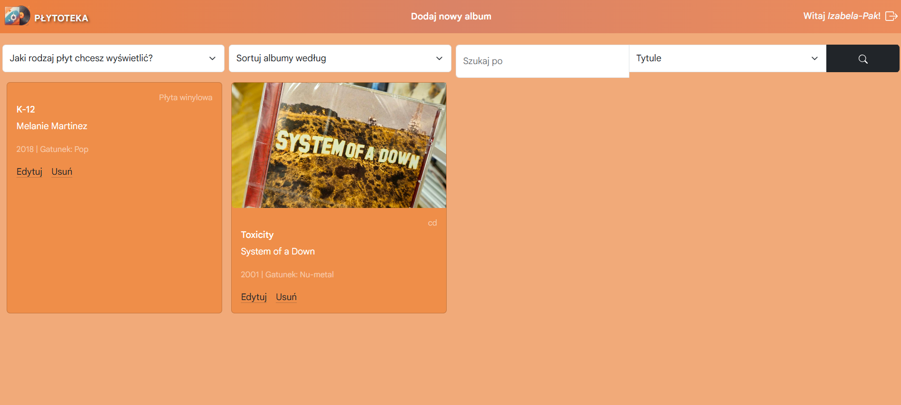
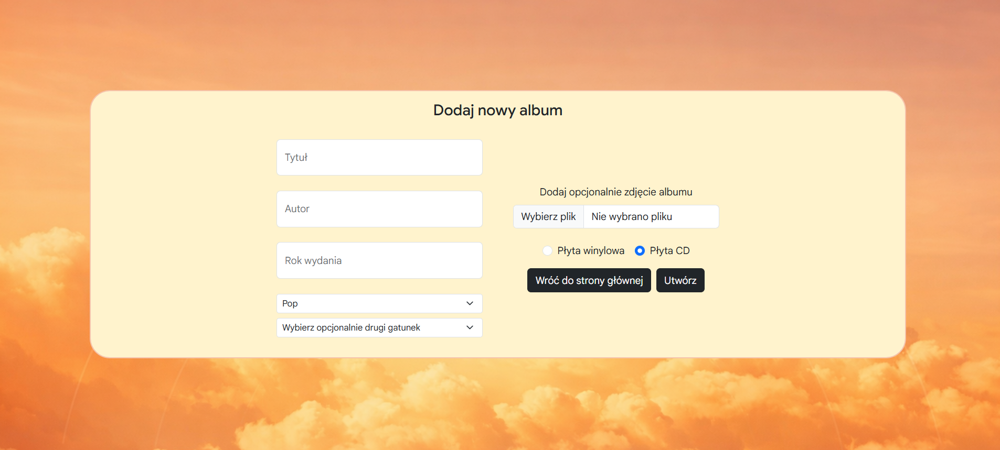

Z zewnętrznych platform korzystano z bezpłatnej wersji, która przez określony czas nieużywania zatrzymuje się powodując problemy z dodaniem płyty, gdy jest załączane do niej zdjęcie.

---

W celu poprawnego działania aplikacji należy dodać w folderze \backend\src\main nowy folder 'resources' w którym należy umieścić plik 'application.properties' zawierający wszystkie dane konfiguracyjne.

Dodatkowo w miejscu pliku docker-compose.yml należy utworzyć plik '.env' w którym zostaną zawarte wszystkie zmienne wrażliwe, kluczowe do działania projektu.

# Uruchomienie aplikacji
W celu uruchomienia aplikacji należy użyć komendy 'docker compose up --build'

Można zobaczyć uruchomione kontenery przy pomocy 'docker compose ps'

Aby wyświetlić logi danego kontenera wystarczy wpisać 'docker compose logs nazwa_kontenera'

W celu podejrzenia wnętrza bazy danych należy wpierw wejść do kontenera 'docker exec -it postgres_db sh', a następnie połączyć się z odpowiednią bazą danych 'psql -U appuser -d appdb'. Po tym przy użyciu zapytań SQL mozna wyświetlić dane lub przy pomocy komendy '\dt' wyświetlić dotępne tabele. 
 

Aby korzystać z aplikacji wystarczy w przeglądarce wpisać 'localhost:3010'.

